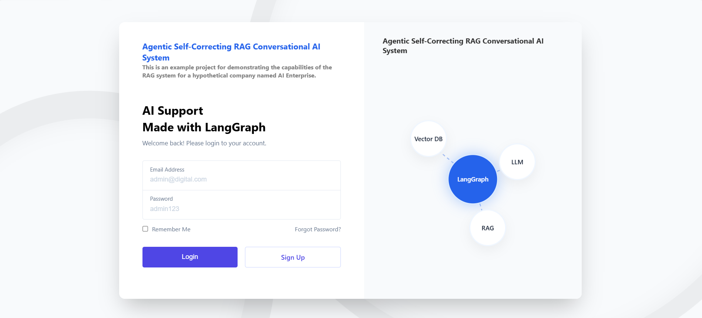
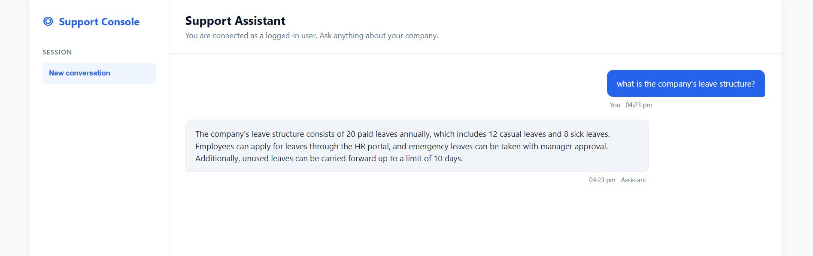
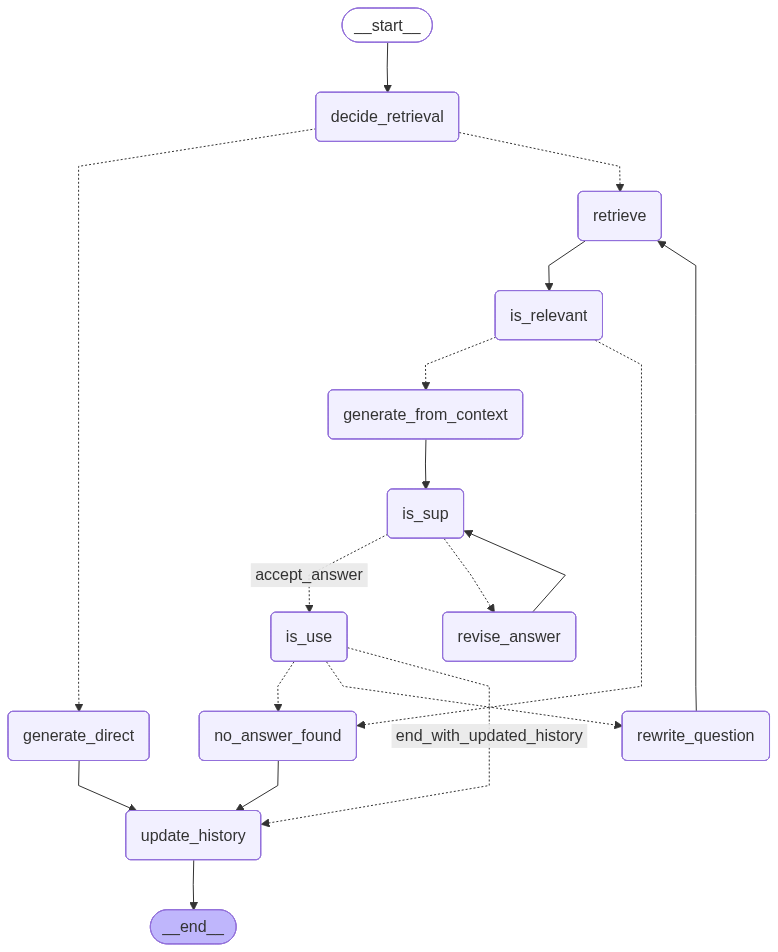
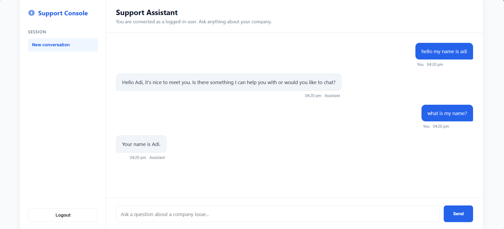

# Autonomous Self-Correcting RAG Agent  
### A Production-Ready Agentic AI System with LangGraph + FastAPI

---

## Overview

This project is a **stateful, self-correcting Retrieval-Augmented Generation (RAG) system** built using **LangGraph** and **FastAPI**.

Unlike traditional RAG pipelines, this system behaves like an **intelligent agent** that can:

- Reflect on its own answers  
- Detect hallucinations  
- Rewrite queries automatically  
- Retry retrieval when needed  
- Maintain conversation memory  

💡 *It doesn’t just answer — it evaluates and improves itself.*

---

## Authentication UI (Login System)

  

- Secure login system using JWT  
- HttpOnly cookies for safe authentication  
- Session-based user interaction  
- Clean and modern UI  

---

## 🖥️ Chat Interface (Support Assistant)

  

- Real-time conversational interface  
- Context-aware responses  
- Smooth user experience  
- Integrated with backend agent  

---

##  Why This is Better Than Traditional RAG

### ❌ Traditional RAG
- One-shot retrieval  
- No correction mechanism  
- High hallucination risk  
- Stateless  

### ✅ This System (LangGraph Agent)
- Iterative reasoning loop  
- Self-evaluation (grounding + usefulness)  
- Automatic query rewriting  
- Stateful conversation memory  

---

## System Architecture (LangGraph Workflow)

  

### Flow Breakdown:

1. **Intent Check (`decide_retrieval`)**
   - Determines if retrieval is needed  

2. **Retrieve**
   - Fetches relevant chunks from FAISS  

3. **Relevance Check (`is_relevant`)**
   - Filters noisy or irrelevant documents  

4. **Generate Answer (`generate_from_context`)**
   - Uses only grounded context  

5. **Self-Evaluation**
   - `is_sup` → Is answer grounded?  
   - `is_use` → Is answer useful?  

6. **Correction Loop**
   - If failed → `rewrite_question` → retry  

7. **Final Output**
   - Only validated answers are returned  

---

## 🔄 Self-Correction & Persistence Flow

  

This is the **core innovation** of the system:

- 🔍 Detects hallucinations before responding  
- 🔁 Automatically rewrites queries  
- 🎯 Improves retrieval iteratively  
- 🧠 Maintains conversation history  

---

## Core Capabilities

###  Adaptive Routing
- Skips retrieval for simple queries  
- Reduces latency and cost  

###  Iterative Self-Correction
- Retries automatically when answers fail validation  

###  Document Relevance Grading
- Ensures only meaningful context is used  

###  Stateful Memory
- Maintains conversation using LangGraph checkpointers  

###  Streaming Responses
- Token-by-token streaming via FastAPI  

###  Secure API Architecture
- JWT authentication via HttpOnly cookies  
- Protection against XSS attacks  

---

##  Tech Stack

| Category | Technology |
|--------|-----------|
| Agent Framework | LangChain + LangGraph |
| LLM | Groq |
| Vector DB | FAISS |
| Embeddings | sentence-transformers/all-MiniLM-L6-v2 |
| Backend | FastAPI + Uvicorn |
| Database | PostgreSQL + SQLAlchemy |
| Frontend | HTML, CSS, JavaScript |

---

## 📈 Example Interaction

**User:**  
> What is the company's leave structure?

**System Flow:**  
- Retrieves documents  
- Filters relevance  
- Generates grounded answer  
- Verifies correctness  
- Returns final response  

---

##  Project Highlights

- Production-ready architecture  
- Modular graph-based design  
- Real-world enterprise use case  
- Clean separation of concerns  
- Highly extensible system  

---

## Conclusion

This is not just a chatbot — it is a **self-correcting AI agent** that:

✔ Thinks  
✔ Evaluates  
✔ Adapts  
✔ Improves  

---

## ⭐ Support

If you like this project, consider giving it a ⭐ on GitHub!

---

##  Future Improvements

- UI enhancements (React / Next.js)   
- Deployment (Docker + Cloud)  

---