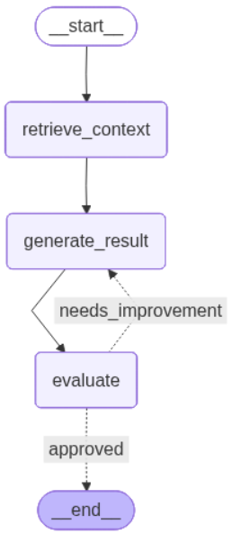

**Self-Correcting RAG Chatbot**

# 🚀 Overview
The Self-Correcting RAG Chatbot is an advanced conversational AI application designed to provide highly accurate and contextually relevant answers by autonomously evaluating and refining its own responses.

Unlike traditional Retrieval-Augmented Generation (RAG) systems that execute a simple retrieve-and-generate sequence, this project implements a critical self-correction loop powered by LangGraph. If the initial answer fails an internal quality check against the retrieved context, the system enters an iterative revision cycle until a high-confidence answer is produced or a maximum revision limit is reached.

This project showcases a robust, production-ready pattern for building reliable and trustworthy LLM applications.

# ✨ Key Features
Self-Correction Loop: Employs a LangGraph state machine to iteratively generate, evaluate, and revise answers, minimizing factual errors and improving response quality.

Advanced RAG: Uses the mmr (Maximal Marginal Relevance) search in the retriever to ensure a diverse yet relevant set of documents is retrieved, enhancing the context.

Modular Architecture: Built with LangChain and LangGraph, providing a clear, maintainable, and scalable structure.

Gemini-Powered Intelligence: Leverages Google's Gemini 2.5 Flash model for fast, high-quality content generation and sophisticated answer evaluation.

Modern Tech Stack: Utilizes Flask for the backend API to handle user requests and JavaScript for a simple, responsive frontend interface.

Persistent Vector Store: Uses Chroma and HuggingFace Embeddings (sentence-transformers/all-MiniLM-L6-v2) for efficient document indexing and retrieval.

# ⚙️ Architecture (LangGraph Flow)
The application is structured as a state machine that follows a continuous refinement process:

START

retrieve_context: Retrieves relevant documents using the user query and populates the state's context.

generate_result: Generates an initial answer using the retrieved context and the chat history.

evaluate: A dedicated LLM call evaluates the generated answer against the retrieved context to check for relevance and factual grounding.

route_evaluation (Conditional Edge):

IF ACCEPT or Max Iterations Reached: Routes to END.

IF REVISE / needs_improvement: Routes back to generate_result for another revision attempt.

# 📈 LangGraph Workflow Diagram

# 🛠️ Tech Stack
Frameworks: LangChain, LangGraph

LLM & API: Google Gemini 2.5 Flash

Embedding Model: HuggingFace sentence-transformers/all-MiniLM-L6-v2 (is running locally in this project)

Vector Store: Chroma DB

Backend: Flask

Frontend: HTML/CSS/JavaScript

# Dependencies: 

langchain-google-genai
langchain-huggingface
langgraph
langchain-core
langchain-community
python-dotenv
Flask